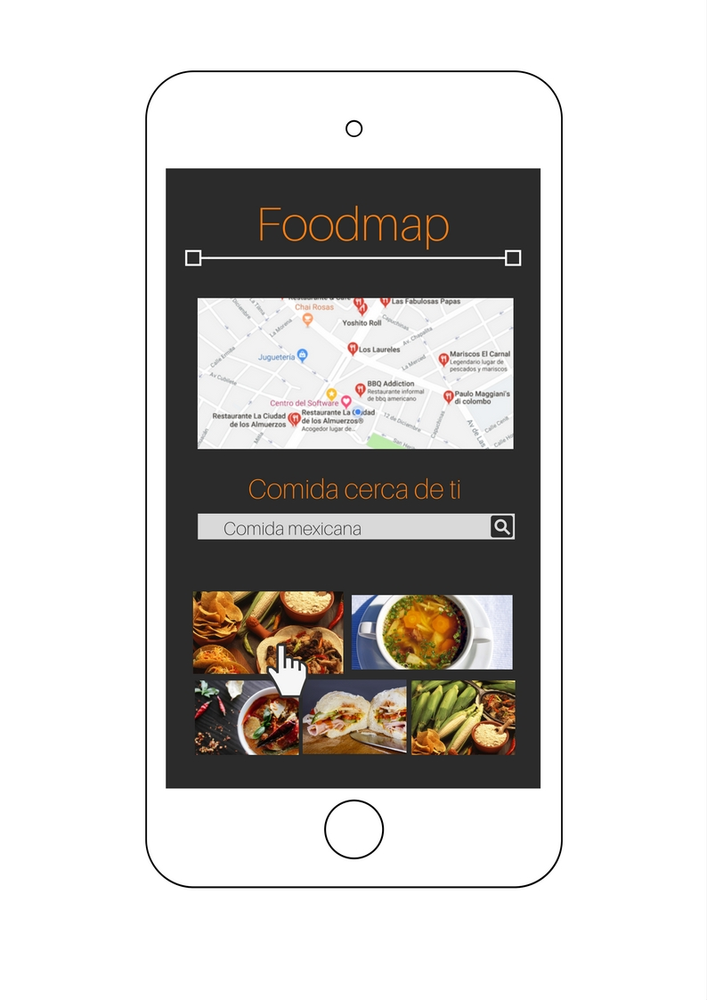

# FoodMaps
* **Track:** _Common Core_
* **Sprint 03:** _JQuery_
* **Unidad:** _04_

## Objetivo
Crear una web-app que a través de un input pueda filtar los restaurantes que se encuentran cerca del usuario.

## Flujo de la aplicación:
Vista splash con duración de 2 a 5 segundos que redirecciona a la vista de principal.

En la vista principal se muestran todos los restaurantes cercanos junto con el input para filtrar la selección del usuario.
Los criterios de busqueda pueden ser por tipo de comida, costo, orden alfabético, etc.

Una vez que el usuario haga su elección deberán mostrarse únicamente aquellos restaurantes que cumplan con la condición.

Se debe agregar un evento mouse over sobre las imágenes, puede mostrar por ejemplo: cambio de tamaño, mostrar un texto, cambio de imagen, información, etc.

Al seleccionar alguno de los restaurantes, deberá mostrarse la información de este a través de un modal.

Una vez cerrado el modal, regresa a la vista principal.

## Flujo de trabajo

1. Establecer estructura de carpetas con los archivos necesarios para el proyecto.

2. Escribir pseudocódigo para identificar funcionalidad requerida.

3. Realizar el marcado del contenido en un archivo html.

4. Desarrollar funcionalidad.

5. Establecer estilos en archivo css.

6. Aplicar los principios de diseño responsive para completar el objetivo del ejercicio.

5. Crear archivo README.

7. Subir a repositorio Git y crear GHpage correspondiente.
